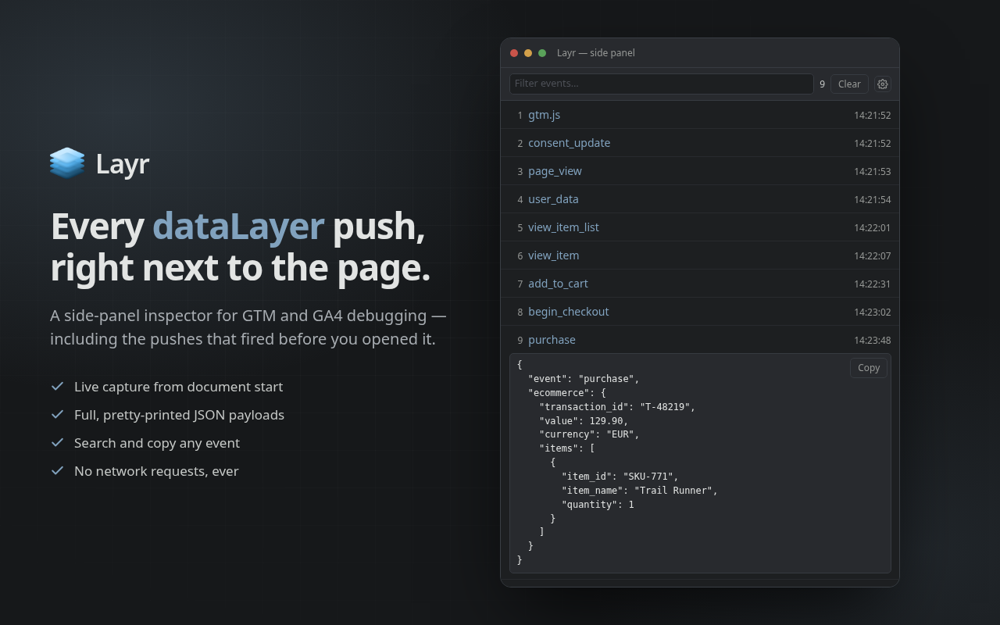

#  Layr

Layr is a lightweight dataLayer inspector for developers and analytics engineers.
Click the icon on any page to open a Chrome side panel that intercepts and displays every `dataLayer.push()` call — including pushes that fired before the panel was opened.

Features:

- Live capture of all dataLayer events as they happen
- Retroactively shows pushes that occurred before the panel was opened
- Expandable rows with pretty-printed JSON
- One-click copy of any event payload
- Filter/search across event names and payloads, with matches highlighted in place
- Clear the log at any time, and adjust the panel's text size from the settings panel
- Persists across soft navigations within the same tab; a real page load clears it

No data ever leaves the browser. No network requests, no tracking.

